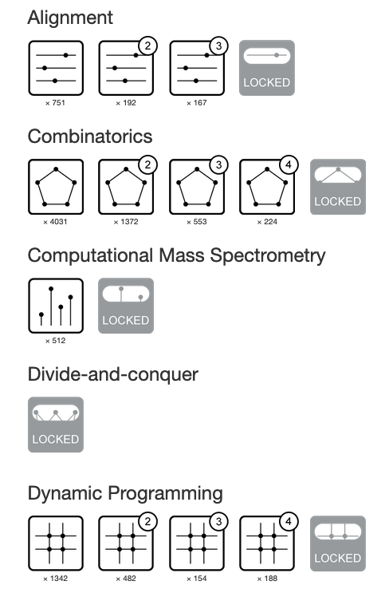

# rosalind
Computational Bioinformatics in Jupyter and Python

These are my solutions to the bioinformatics challenges set here:  http://rosalind.info/users/rmbryan/

The solution file "sseq.py" resolves http://rosalind.info/problems/sseq/

